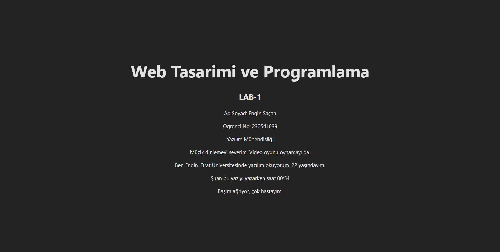

# Web LAB-1- Hello Project

## About
This project created within the scope of Web Desing and Programming lecture LAB-1 using Vite + React + TypeScript.

## Developer
**Full Name:** Engin Saçan  

**Student No:** 230541039

## Technologies Used
- React 18
- TypeScript
- Vite

## Setup
```bash
npm install
```

## Run the Project
```bash
npm run dev
```

Open http://localhost:5173 URL in your browser.

## ScreenShots
